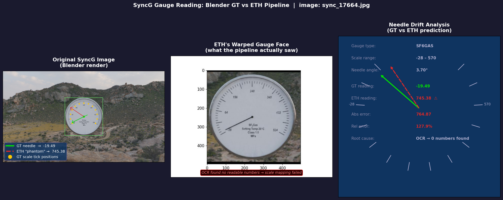

# AssetOpsBench v2 — Layer 1: Gauge Value Reading

This module evaluates analog gauge reading approaches on the
[SyncG synthetic dataset](https://github.com/yl-data/SyncG) and real industrial gauges.
It is the **Layer 1 perception baseline** for the AssetOpsBench v2 paper (ICLR 2027).

---

## Experiment Summary

| Config | Method | acc@5% | acc@10% | Mean Err | n | Verdict |
|--------|--------|--------|---------|----------|---|---------|
| **A** | ETH analog gauge pipeline | 5.1% | ~6% | ~85% | 39 | INSUFFICIENT |
| **B** | Gemini 3.5-flash VLM direct | **95.0%** | **100%** | **1.9%** | 20 | **SUFFICIENT** |
| **C** | ETH angle + Gemini scale (hybrid) | 10.0% | 10.0% | 36.5% | 20 | POOR |
| C-oracle | ETH angle + GT scale | 10.2% | 14.3% | 35.6% | 49 | POOR |

> **Key finding**: Direct VLM gauge reading (Config B) is 18.5× more accurate than
> the ETH geometric pipeline on SyncG synthetic images.
> The ETH pipeline fails because its OCR step (DB_r18, trained on ICDAR2015 street text)
> cannot detect Blender-rendered gauge numerals.

---

## How SyncG Ground Truth Is Generated (Blender formula)

SyncG images are rendered by Blender. The needle angle is set analytically — no OCR is
involved in GT generation. Each annotation JSON stores:

```
ground_truth = start_value + (pointer_rotate_degree / arc_span_degrees) × gauge_range

where:
  arc_span_degrees = long_interval_degree × long_num   (e.g. 10° × 13 = 130°)
  gauge_range      = long_interval_value  × long_num   (e.g. 19  × 13 = 247 units)
```

**Example** (`sync_16002.json`):
```json
{
  "pointer_rotate_degree": 1.227,   ← Blender needle angle from scale start
  "long_interval_degree":  10,      ← degrees between printed numbers
  "long_num":              13,      ← number of intervals on the scale
  "long_interval_value":   19,      ← units between printed numbers
  "start_value":           16,      ← minimum value (gauge_min)
  "ground_truth":          18.332   ← = 16 + (1.227/130) × 247
}
```

`gauge_max = start_value + long_interval_value × long_num = 16 + 247 = 263`

---

## Visualizing Needle Drift

The "needle drift" visualization shows the gap between where Blender placed the
needle (GT) and where ETH's OCR failure causes it to predict an absurd value.

```bash
python src/perception/visualizations/visualize_needle_drift.py \
    --image_stem sync_17664 \
    --syncg_dir  src/perception/data/syncg \
    --eth_results src/perception/eth_results/ \
    --output src/perception/visualizations/needle_drift_viz.png
```

The script produces a 3-panel figure:
- **Panel 1**: Original gauge with GT needle (green) and ETH phantom arrow (red dashed)
- **Panel 2**: ETH's perspective-warped gauge face (OCR is run on this)
- **Panel 3**: Schematic dial showing the angular drift magnitude

Sample output (`sync_17664` — sf6gas gauge):



GT = −19.49, ETH = 745.38, relative error = 122.9% (OCR detected wrong scale)

---

## Setup

### Requirements

```bash
# Project venv (Python 3.12)
uv pip install google-genai Pillow requests matplotlib

# Ollama (for local VLMs)
OLLAMA_MODELS=/media/<drive>/ollama_models ollama pull llava:7b  # optional
```

### SyncG dataset

```bash
# Download to external drive (~15 GB)
python src/perception/download_syncg.py --dest /media/<drive>/syncg_data

# Symlink for evaluation scripts
ln -s /media/<drive>/syncg_data src/perception/data/syncg
```

Expected structure after extraction:
```
src/perception/data/syncg/syncG/syncG/
    annotations/test/*.json     ← 1567 annotation JSONs
    images/test/*.jpg           ← 4000 gauge images
```

> **Note**: The archive has a double-nested `syncG/syncG/` structure due to how the
> zip was packaged. All scripts in this module already account for this.

### ETH analog gauge reader

```bash
# Conda env on external drive
conda create --prefix /media/<drive>/envs/gauge_reader python=3.8
conda activate /media/<drive>/envs/gauge_reader
pip install -r /home/<user>/analog_gauge_reader/requirements.txt
# Download MMOCR weights (see evaluate_eth.py header for curl commands)
```

---

## Running the Evaluations

### Config A — ETH pipeline

```bash
# Run ETH on SyncG test images
cd /home/<user>/analog_gauge_reader
/media/<drive>/envs/gauge_reader/bin/python pipeline.py \
    --input /media/<drive>/syncg_data/syncG/syncG/images/test/ \
    --base_path /path/to/AssetOpsBench/src/perception/eth_results/ \
    --detection_model   models/gauge_detection_model.pt \
    --key_point_model   models/key_point_model.pt \
    --segmentation_model models/segmentation_model.pt

# Evaluate against SyncG GT
cd /path/to/AssetOpsBench
.venv/bin/python src/perception/evaluate_eth.py \
    --annotations /media/<drive>/syncg_data/syncG/syncG/annotations/test/ \
    --eth_base    src/perception/eth_results/
```

### Config B — Direct VLM reading

```bash
export GOOGLE_API_KEY="<your-key>"    # Gemini (free tier: 20 req/day; billing recommended)
# OR: ollama serve & ollama pull llava:7b  (local, no quota)

.venv/bin/python src/perception/vlm_gauge_reader.py \
    --syncg_dir src/perception/data/syncg \
    --models    gemini-3.5-flash \
    --n_samples 50 \
    --output    src/perception/vlm_results/
```

**Supported models** (`--models`):
| Key | Actual model | Notes |
|-----|-------------|-------|
| `gemini-3.5-flash` | `gemini-3.5-flash` | Best accuracy; 20 req/day free |
| `gemini-2.5-flash` | `gemini-2.5-flash` | Also strong; 20 req/day free |
| `moondream` | moondream via Ollama | 1.7 GB; too small for gauges |
| `llava` | llava:latest via Ollama | 4.7 GB; local, no quota |

### Config C — ETH-VLM hybrid

```bash
export GOOGLE_API_KEY="<your-key>"

.venv/bin/python src/perception/eth_vlm_hybrid.py \
    --syncg_dir   src/perception/data/syncg \
    --eth_results src/perception/eth_results/ \
    --n_samples   20 \
    --output      src/perception/hybrid_results/
```

> **Why Config C underperforms**: ETH's "Rotate image by X degrees" log entry is the
> perspective-correction rotation applied to the warped gauge face, **not** the needle's
> arc-fraction. Using it as a proxy for needle position yields ~36% mean error even
> when given the perfect GT scale. A proper hybrid requires exposing ETH's internal
> needle-keypoint arc-fraction from its DINOv2 geometry step.

---

## File Structure

```
src/perception/
├── README.md                          ← this file
├── download_syncg.py                  ← download SyncG dataset
├── evaluate_eth.py                    ← Config A evaluation
├── vlm_gauge_reader.py                ← Config B evaluation (Gemini / Ollama)
├── eth_vlm_hybrid.py                  ← Config C evaluation (ETH angle + VLM scale)
├── setup_eth_env.sh                   ← conda env setup for ETH
├── visualizations/
│   ├── visualize_needle_drift.py      ← reproduce needle_drift_viz.png
│   └── needle_drift_viz.png           ← sample drift visualization (sync_17664)
├── vlm_results/
│   ├── summary.json                   ← cross-model comparison
│   └── gemini-3.5-flash_results.json  ← per-image results (Config B, n=20)
├── hybrid_results/
│   └── hybrid_results.json            ← Config C results (n=20)
└── evaluation_results.json            ← Config A ETH results (n=39 attempted)
```

---

## MeasureBench 2026 Context

MeasureBench 2026 reports the best VLM (Gemini 2.5 Pro) at ~30% acc@5% on
**real industrial gauges**. Our SyncG synthetic result (95% acc@5%) is much higher
because synthetic images have:
- Controlled lighting, no glare, no occlusion
- Perfect circular dial geometry
- Clean rendered fonts (though these break ETH's OCR)

The sim-to-real gap (95% synthetic → ~30% real) motivates the real-gauge evaluation
split planned with facility photographs.
